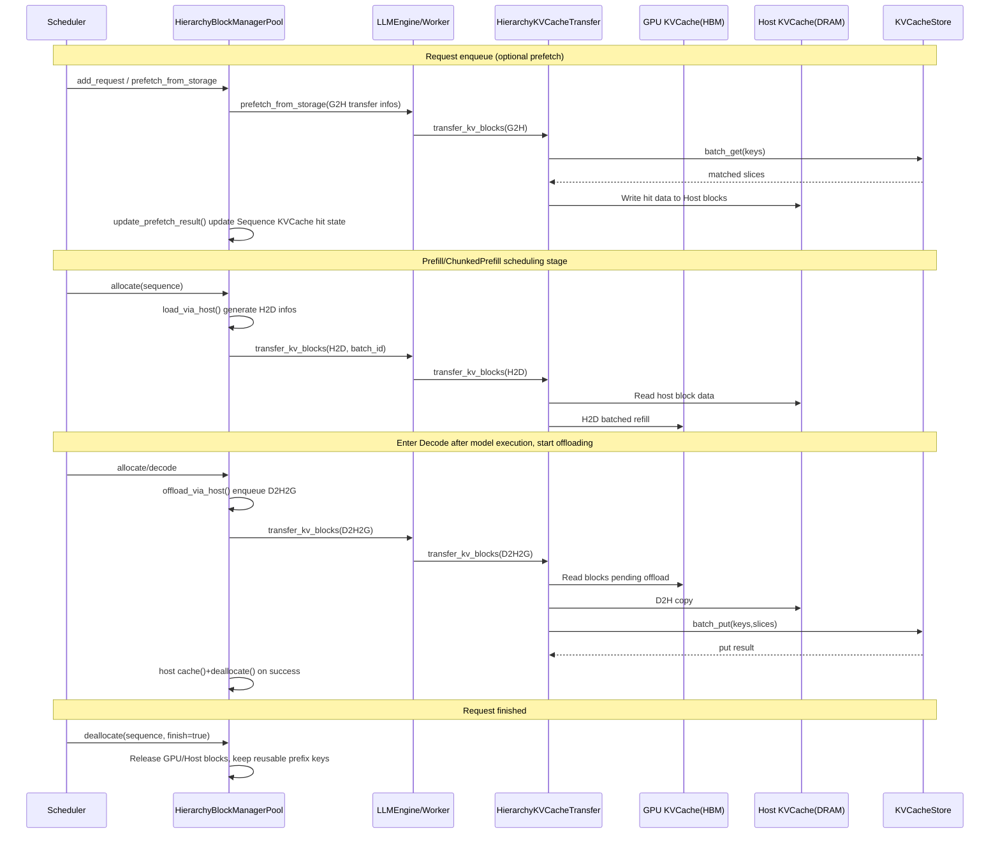
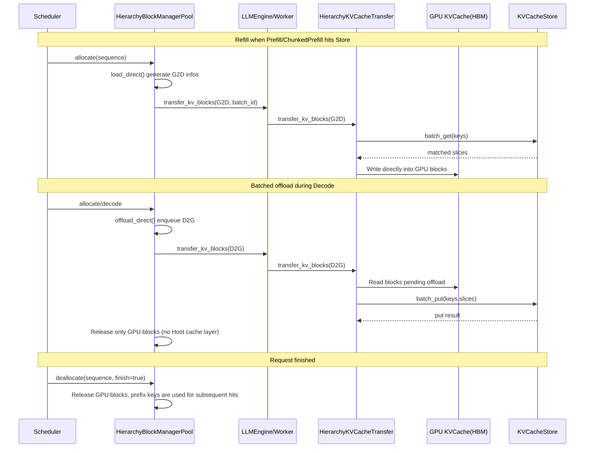

# Hierarchy KV Cache

## 1. Background

In long-context scenarios, KVCache capacity and bandwidth quickly become bottlenecks for LLMs. xLLM's hierarchy KV Cache aims to extend KV from "single-host single-GPU resources" to "cross-instance reusable resources," reduce repeated Prefill, and improve overall throughput and resource utilization.

## 2. Design Goals

1. Enable controlled KV flow across three tiers: `Device(HBM)`, `Host(DRAM)`, and `Store(global storage)`.
2. Reuse historical KV through Prefix hits to reduce repeated Prefill.
3. Decouple state synchronization (control plane) from data movement (data plane) for elastic scaling.

## 3. Architecture Overview

xLLM's global KVCache consists of two paths:

1. Control-plane path (state awareness and routing)

- `etcd`: instance registration, discovery, and metadata synchronization.
- `xLLM Service`: instance management, request routing, and load awareness.
- `PrefixCacheWithUpload + XServiceClient`: uploads local Prefix cache changes (added/removed hash keys).

2. Data-plane path (actual KV read/write)

- `HierarchyBlockManagerPool`: decides load/offload strategies during scheduling and generates `BlockTransferInfo`.
- `HierarchyKVCacheTransfer`: executes `G2H/H2D/D2H2G/D2G/G2D` transfers.
- `KVCacheStore (Mooncake Client)`: executes `batch_put/batch_get/batch_exist`.

Note: `enable_cache_upload` only reports cache state changes and does not transfer KV payload data; KV payload data is handled by `KVCacheStore`.

The overall architecture is shown below:

## 4. KVCache Store Feature Summary

### 4.1 Initialization and Mode Selection

During initialization, `HierarchyKVCacheTransfer` selects the `KVCacheStore` slicing format based on `host_blocks_factor`:

- `host_blocks_factor > 1`: `TensorFormat::BLOCK_WISE`, using the Host cache pool as the carrier for Store read/write.
- `host_blocks_factor < 1`: `TensorFormat::LAYER_WISE`, direct Store-Device connection with batched copy by layer.

Additional behaviors:

- When `store_protocol=rdma`, if environment variable `DEVICE_NAMES` is not set, it falls back to `tcp`.
- When `enable_mla=true`, `tp_rank/tp_size` is fixed to `0/1` on the Store side.

### 4.2 Key Rules and Slice Organization

Store keys follow a unified format:

`hash_key-tp_rank-slice_idx`

- `hash_key`: `XXH3 128-bit` chunked prefix hash computed by `PrefixCache::compute_hash_keys(...)`.
- `tp_rank`: used for tensor parallel isolation.
- `slice_idx`: index for layer-wise slicing.

Two slicing formats:

- `TensorFormat::BLOCK_WISE`
  - Each block slice contains K/V(/index) for all layers.
  - Commonly used in Host relay scenarios (`D2H2G`, `G2H + H2D`).
- `TensorFormat::LAYER_WISE`
  - Groups layers into slices according to `layers_wise_copy_batchs`.
  - Commonly used in Store direct-connect scenarios (`D2G`, `G2D`).

### 4.3 Semantics of `batch_put/get/exist`

| Interface | Purpose | Key Semantics |
| --- | --- | --- |
| `batch_put` | Batch write to Store | Before writing, it runs `IsExist` per key. Existing keys are skipped but still counted as "success" to avoid duplicate overwrite. |
| `batch_get` | Batch pull KV | Reads by exact `hash_key-tp_rank-slice_idx` and writes data into target blocks (Host or Device). |
| `batch_exist` | Batch hit query | Expanded into `keys x tp_size x layers_wise_copy_batchs` queries. Counting stops at the first miss and returns the number of consecutive reusable blocks. |

### 4.4 TransferType to Function Mapping

| TransferType | Path | Entry Function |
| --- | --- | --- |
| `G2H` | Store -> Host | `HierarchyKVCacheTransfer::transfer_kv_blocks(slice)` |
| `H2D` | Host -> Device | `HierarchyKVCacheTransfer::load_via_host(...)` |
| `D2H2G` | Device -> Host -> Store | `HierarchyKVCacheTransfer::offload_via_host(...)` |
| `D2G` | Device -> Store | `HierarchyKVCacheTransfer::offload_direct(...)` |
| `G2D` | Store -> Device | `HierarchyKVCacheTransfer::load_direct(...)` |

## 5. Key Call Chains

### 5.1 Prefetch on Request Enqueue (Host Relay Mode Only)

1. On scheduler enqueue, call `kv_cache_manager_->prefetch_from_storage(request)`.
2. `HierarchyBlockManagerPool::prefetch_from_storage(...)` assembles `BlockTransferInfo` for `G2H`.
3. `LLMEngine::prefetch_from_storage(...)` dispatches to each TP worker.
4. Worker-side `PrefetchFromStorage` uses streaming batch processing (batch size controlled by `prefetch_bacth_size`).
5. `HierarchyKVCacheTransfer` calls `KVCacheStore::batch_get(...)` to write hit KV into Host blocks.
6. During scheduling, `update_prefetch_result(timeout)` is called to decide whether to wait or continue based on `prefetch_timeout`.

### 5.2 Prefill/Chunked Prefill Refill

1. `HierarchyBlockManagerPool::allocate(...)` decides during Prefill:

- Host relay: `load_via_host`, generating `H2D` tasks.
- Store direct-connect: `load_direct`, generating `G2D` tasks.

2. `transfer_blocks(...)` dispatches tasks to workers.
3. Workers execute the corresponding copy through `HierarchyKVCacheTransfer`, and connect to the compute stage through a layer-wise synchronizer.

### 5.3 Decode Offload

1. During Decode, `allocate(...)` triggers offload policy:

- Host relay: `offload_via_host`, task type `D2H2G`.
- Store direct-connect: `offload_direct`, task type `D2G`.

2. `transfer_blocks()` asynchronously submits offload tasks.
3. After successful offload, Device blocks are released; in Host relay mode, Host blocks are additionally cached and released.

### 5.4 Control-Plane Reporting (Decoupled from Store Data Plane)

1. `PrefixCacheWithUpload` writes hash-key changes generated by insert/evict into a double-buffer event set.
2. `BlockManagerPool::get_merged_kvcache_event(...)` aggregates events.
3. `XServiceClient::heartbeat()` periodically reports `stored_cache/removed_cache` to xLLM Service.

### 5.5 Sequence Diagrams for KVCache Flow Across Three Storage Tiers

#### 5.5.1 Host Relay Mode (GPU <-> Host <-> Store)

#### 5.5.2 Direct Connect (GPU <-> Store)

## 6. Runtime Mode Mapping

| Parameter Combination | Runtime Mode | Primary Data Path |
| --- | --- | --- |
| `host_blocks_factor > 1` and `enable_kvcache_store=true` | Host relay | `Device <-> Host <-> Store` |
| `host_blocks_factor = 0` and `enable_kvcache_store=true` | Store direct-connect | `Device <-> Store` |
| `host_blocks_factor > 1` and `enable_kvcache_store=false` | Local hierarchy (no Store) | `Device <-> Host` |
| `enable_kvcache_store=false` | Non-global KVCache scenario | Store is not accessed |

Recommendation:

- In the current implementation, set `host_blocks_factor` to either `0` or `>1`, and avoid boundary-value configurations.

## 7. Parameter Effect Conditions (Important)

The following reflects the actual effective logic in code:

| Parameter | Actual Effective Condition |
| --- | --- |
| `enable_service_routing` | `FLAGS_enable_service_routing \\ FLAGS_enable_disagg_pd` |
| `enable_cache_upload` | `(FLAGS_enable_service_routing \\ FLAGS_enable_disagg_pd) && FLAGS_enable_prefix_cache && FLAGS_enable_cache_upload` |
| `enable_kvcache_store` | `FLAGS_enable_kvcache_store && FLAGS_enable_prefix_cache` |
| `prefetch_from_storage` | Triggered only when `enable_kvcache_store=true` and a Host block pool exists (Host relay mode). |

Common parameter descriptions:

| Parameter | Description |
| --- | --- |
| `--enable_prefix_cache` | Prerequisite for prefix hash and hits (Store depends on this switch). |
| `--enable_kvcache_store` | Enables Store data-plane read/write path. |
| `--host_blocks_factor` | Selects Host relay or Store direct-connect mode. |
| `--store_protocol` | Store protocol, commonly `tcp/rdma`. |
| `--store_master_server_address` | Store master address. |
| `--store_metadata_server` | Metadata service address. |
| `--store_local_hostname` | Local Store client address (recommended `IP:PORT`). |
| `--prefetch_timeout` | Prefetch wait window (ms), `0` means no waiting. |
| `--prefetch_bacth_size` | Prefetch batch size. |
| `--layers_wise_copy_batchs` | Number of layer-wise copy batches. |
| `--offload_batch` | Batch threshold for triggering offload during Decode. |

## 8. Usage Example

- [scripts/run.sh](../../../scripts/run.sh). Use `-h` to see specific parameters.

## 9. FAQ and Troubleshooting

1. `enable_kvcache_store=true` but no reuse hits.

- Check whether `--enable_prefix_cache=true` is also enabled.
- Check whether this is a "full-block prefix" hit. The tail of an incomplete block does not form reusable blocks.

2. `Failed to lock memory pool` when starting Host relay.

- This is an `mlock` page-lock failure. Adjust `ulimit -l` as suggested in logs, then restart.

3. `rdma` mode initialization is abnormal or falls back automatically.

- Check `DEVICE_NAMES`; if unset, it degrades to `tcp`.

4. Prefetch effect is unstable.

- Tune `prefetch_timeout` and `prefetch_bacth_size`.
- Note that direct-connect mode with `host_blocks_factor=0` does not go through `G2H` prefetch.

## 10. Code Locations

- `xllm/core/framework/kv_cache/kv_cache_store.{h,cpp}`
- `xllm/core/framework/kv_cache/hierarchy_kv_cache_transfer.{h,cpp}`
- `xllm/core/framework/block/hierarchy_block_manager_pool.{h,cpp}`
- `xllm/core/framework/prefix_cache/prefix_cache_with_upload.{h,cpp}`
- `xllm/core/runtime/xservice_client.cpp`
- `xllm/core/scheduler/continuous_scheduler.cpp`

## 11. Related Documents

- [Prefix Cache Mechanism](./prefix_cache.md)
- [PD Disaggregation](./disagg_pd.md)
