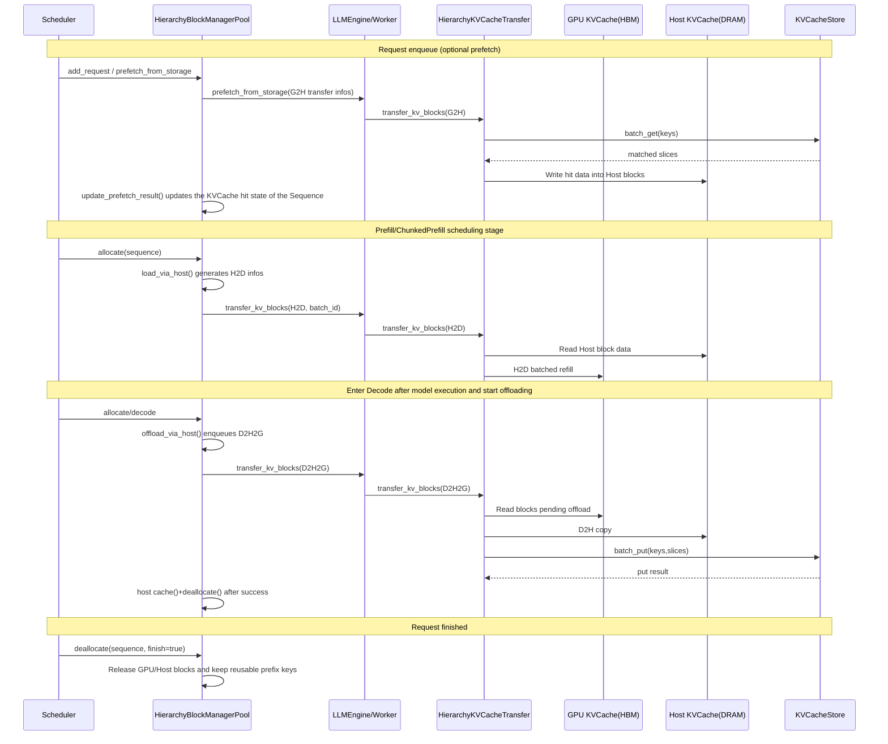

# Global Multi-Level KV Cache

## 1. Problems and Challenges

### 1.1 Problem 1: Prefix Cache Hits Depend on Routing in Multi-Turn Conversations and Multi-Replica Deployments

In multi-turn conversation scenarios, the answer from the previous turn is usually appended to the next request and becomes part of the next prompt. As a result, the KVCache generated in the previous turn can theoretically be reused in the next turn.

However, in multi-replica deployments, if the Prefix Cache is stored only in the HBM of the local inference node, an extra constraint appears:

- The KVCache for a given prefix exists only on the node that generated it.
- If the next request is load-balanced to another replica, it cannot hit the previous Prefix Cache even if it shares a large prefix with the last request.
- This means that to achieve a high prefix hit rate, requests cannot be distributed only by "random" or "pure load-based" policies. Routing also has to consider which node already holds reusable prefixes.

In other words, in multi-replica scenarios, Prefix Cache is not just a local cache problem. It is also a routing problem.

#### Additional Issues in PD Separation

In PD separation scenarios, the problem becomes more severe.

- Decode nodes continuously accumulate large amounts of historical KVCache.
- But when those KVCaches remain only on D nodes, they cannot directly help later Prefill tasks.
- Simply routing requests to the node that holds the cache does not solve this, because Prefill and Decode already happen on nodes with different roles.

### 1.2 Problem 2: HBM-Only Prefix Cache Ages Out Under Capacity Limits

Even if requests are routed to the "correct" node, relying only on the Prefix Cache in HBM is still not enough.

- HBM is a core resource for model execution. It has to store both model weights and KVCache for active requests.
- As contexts grow longer, concurrency increases, or long-sequence requests keep arriving, the HBM space available for Prefix Cache becomes increasingly tight.
- Old KVCache entries are eventually evicted or aged out because of capacity limits.
- As a result, even if the same request later arrives at the same node again, the corresponding Prefix Cache may no longer be available, and Prefill still has to be recomputed.

Therefore, local HBM Prefix Cache can only solve reuse within a short time window and on a single node. It cannot reliably support global KV reuse across time and across nodes.

## 2. Solutions

To address these issues, xLLM uses two complementary solutions:

### 2.1 Solution 1: KV Cache Aware Scheduling

To address the problem that Prefix Cache hits depend on routing in multi-replica deployments, xLLM introduces a cache-aware scheduling path:

- `xLLM Instance`: reports local Prefix Cache additions/removals and node load through heartbeats.
- `xLLM Service`: performs cache-aware routing based on the prefix cache information and load reported by each instance.

### 2.2 Solution 2: Global KVCache Pool

To address the problems that local HBM cache ages out and that D-node cache in PD separation cannot contribute to Prefill, xLLM introduces the global KVCache Pool.

- Through `Mooncake Store`, KVCache is extended from a single-node HBM-local resource into a globally accessible resource.
- KVCache generated by any node can be written into the global Store.
- Later requests on any node can read and reuse that KVCache from the global Store through a globally unique key.

For the different accelerator types supported by xLLM, the KVCache Pool provides two data-plane paths:

- Direct-connect mode: `Device <-> Store`
  - A single RH2D hop gives a shorter data path and higher transfer bandwidth.
  - Currently this mode mainly supports NPU devices.
- Host relay mode: `Device <-> Host <-> Store`
  - Implemented through Host staging plus RDMA transport, with stronger compatibility.
  - Uses prefetch and hierarchical copies to overlap compute and copy, so performance is slightly lower than direct-connect mode.

## 3. Detailed Design

xLLM's global KVCache consists of two paths, corresponding to the two solutions above.

### 3.1 Cache-Aware Scheduling

- `xLLM Service`: instance management, request routing, and load awareness.
- `PrefixCache + XServiceClient`: uploads local Prefix cache changes (added/removed hash keys) and load information.

### 3.2 KVCache Pool

- `HierarchyBlockManagerPool`: decides load/offload strategies during scheduling and generates `BlockTransferInfo`.
- `HierarchyKVCacheTransfer`: executes `G2H/H2D/D2H2G/D2G/G2D` transfers.
- `KVCacheStore (Mooncake Client)`: executes `batch_put/batch_get/batch_exist`.

#### 3.2.1 Host Relay Mode

#### 3.2.2 Direct-Connect Mode

## 4. KVCache Pool Feature Summary

### 4.1 Initialization and Mode Selection

When `HierarchyKVCacheTransfer` is initialized, it chooses the slice format of `KVCacheStore` based on `host_blocks_factor`. However, combined with the Host block creation logic in `HierarchyBlockManagerPool`, only two configurations are currently stable in practice:

- `host_blocks_factor == 0`: `TensorFormat::LAYER_WISE`, where Store is directly connected to Device and data is copied in batches by layer.
- `host_blocks_factor > 1`: `TensorFormat::BLOCK_WISE`, where the Host cache pool is used as the carrier for Store read/write.

Implementation limits (important):

- In `HierarchyKVCacheTransfer`, `host_blocks_factor < 1.0` selects `LAYER_WISE`, and `>= 1.0` selects `BLOCK_WISE`.
- But whether `HierarchyBlockManagerPool` creates a Host block manager depends on whether `host_num_blocks = floor(hbm_blocks * host_blocks_factor)` is greater than `0`.
- At the same time, the page-aligned Host buffer is created only when `host_blocks_factor > 1`.
- Therefore, `host_blocks_factor == 1` and `0 < host_blocks_factor < 1` both fall into inconsistent paths in the current implementation and should not be used.

Additional behaviors:

- When `store_protocol=rdma`, if the environment variable `DEVICE_NAMES` is not configured, it falls back to `tcp`.
- When `enable_mla=true`, the Store side fixes `tp_rank/tp_size` to `0/1`.

### 4.2 Key Rules and Slice Organization

Store keys follow the unified format:

`hash_key-tp_rank-slice_idx`

- `hash_key`: the `XXH3 128-bit` chunked prefix hash computed by `PrefixCache::compute_hash_keys(...)`.
- `tp_rank`: used for tensor-parallel isolation.
- `slice_idx`: used as the layer-wise slice index.

Here, `hash_key` is not an independent hash of the current block content. It is the complete prefix hash up to the current block:

- First block: `XXH3_128(block_tokens)`
- Subsequent blocks: `XXH3_128(prev_hash || current_block_tokens)`

This means the hit semantics are "continuous prefix hit" rather than arbitrary independent block reuse.

Two slice formats are supported:

- `TensorFormat::BLOCK_WISE`
  - Each block slice contains K/V(/index) for all layers.
  - This corresponds to the aggregated block view actively constructed in DRAM in Host relay mode.
  - In a common K/V case, one logical aggregated block can be reduced to `2` contiguous addresses instead of `layers * 2` scattered addresses.
  - Commonly used in Host relay scenarios (`D2H2G`, `G2H + H2D`).
- `TensorFormat::LAYER_WISE`
  - Layers are grouped into slices according to `layers_wise_copy_batchs`.
  - This corresponds to the Store view that preserves the original layer-major HBM layout in direct-connect mode.
  - Commonly used in Store direct-connect scenarios (`D2G`, `G2D`).

### 4.3 Semantics of `batch_put/get/exist`

| Interface | Purpose | Key Semantics |
| --- | --- | --- |
| `batch_put` | Batch write to Store | Before writing, `IsExist` is executed per key. Existing keys are skipped and still counted as "success" to avoid duplicate overwrites. |
| `batch_get` | Batch pull KV | Reads exact keys in the form `hash_key-tp_rank-slice_idx` and writes the data into target blocks (Host or Device). |
| `batch_exist` | Batch hit query | Expands to `keys x tp_size x layers_wise_copy_batchs` queries and stops counting at the first miss. A block counts as a hit only when all TP ranks and all slices of that block exist. |

### 4.4 TransferType to Function Mapping

| TransferType | Path | Entry Function |
| --- | --- | --- |
| `G2H` | Store -> Host | `HierarchyKVCacheTransfer::transfer_kv_blocks(slice)` |
| `H2D` | Host -> Device | `HierarchyKVCacheTransfer::load_via_host(...)` |
| `D2H2G` | Device -> Host -> Store | `HierarchyKVCacheTransfer::offload_via_host(...)` |
| `D2G` | Device -> Store | `HierarchyKVCacheTransfer::offload_direct(...)` |
| `G2D` | Store -> Device | `HierarchyKVCacheTransfer::load_direct(...)` |

## 5. Parameter Configuration

Common parameters:

| Parameter | Description |
| --- | --- |
| `--enable_prefix_cache` | Prerequisite for prefix hash generation and cache hits (Store depends on this switch). |
| `--enable_kvcache_store` | Enables the Store data-plane read/write path. |
| `--host_blocks_factor` | Selects Host relay mode or Store direct-connect mode. |
| `--store_protocol` | Store protocol, commonly `ub/rdma`. |
| `--store_master_server_address` | Store master address. |
| `--store_metadata_server` | Metadata service address. |
| `--store_local_hostname` | Local Store client address (recommended `IP:PORT`). |
| `--prefetch_timeout` | Prefetch wait window in milliseconds. `0` means do not wait. |
| `--prefetch_bacth_size` | Prefetch batch size. |
| `--layers_wise_copy_batchs` | Number of layer-wise copy batches. In the current implementation, it is recommended to use a value that evenly divides the number of layers. |
| `--offload_batch_size` | Batch threshold that triggers offload during Decode. |

Actual effective logic:

| Parameter | Actual Effective Condition |
| --- | --- |
| `enable_service_routing` | `FLAGS_enable_service_routing || FLAGS_enable_disagg_pd` |
| `enable_cache_upload` | `(FLAGS_enable_service_routing || FLAGS_enable_disagg_pd) && FLAGS_enable_prefix_cache && FLAGS_enable_cache_upload` |
| `enable_kvcache_store` | `FLAGS_enable_kvcache_store && FLAGS_enable_prefix_cache` |
| `prefetch_from_storage` | Triggered only when `enable_kvcache_store=true` and a Host block pool exists (Host relay mode). |
