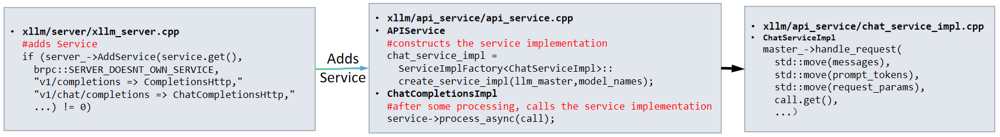
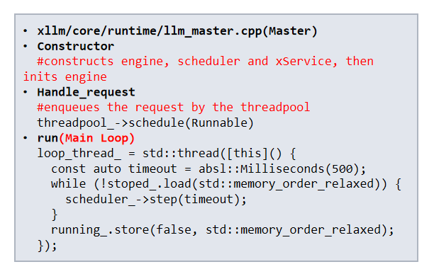
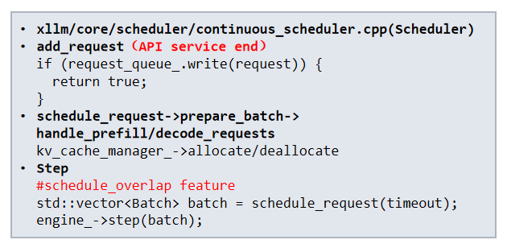
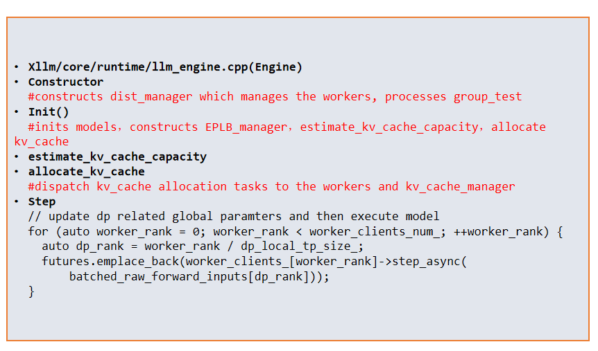
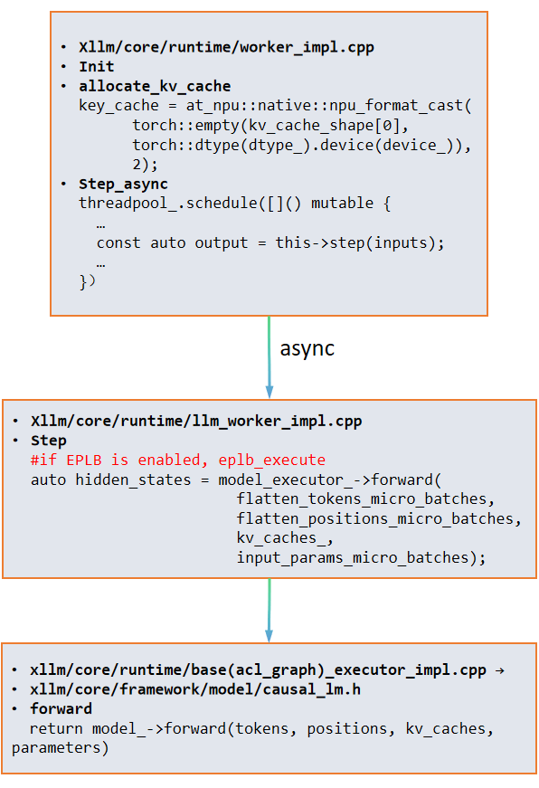
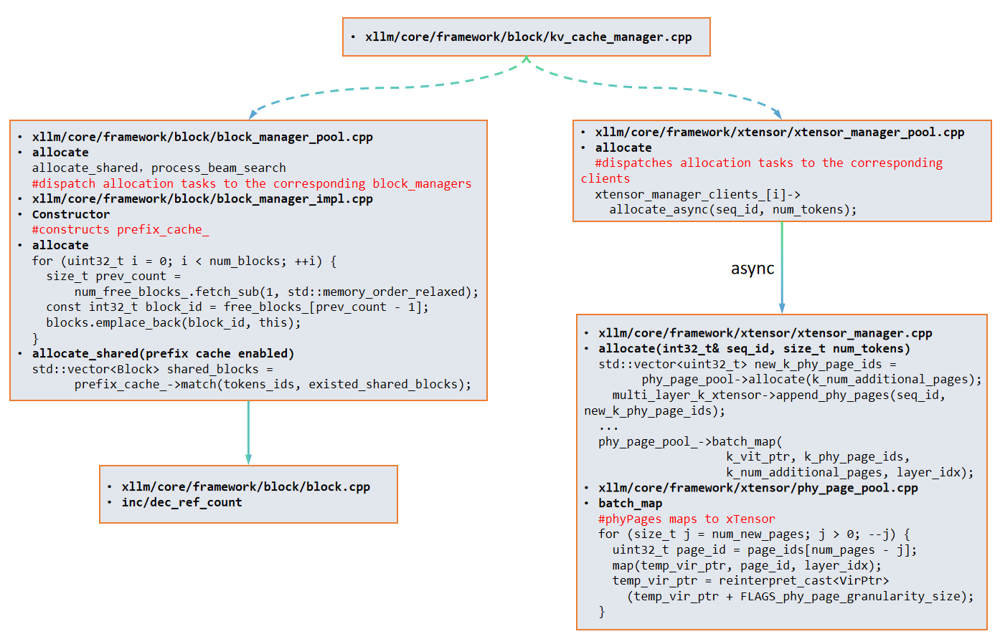
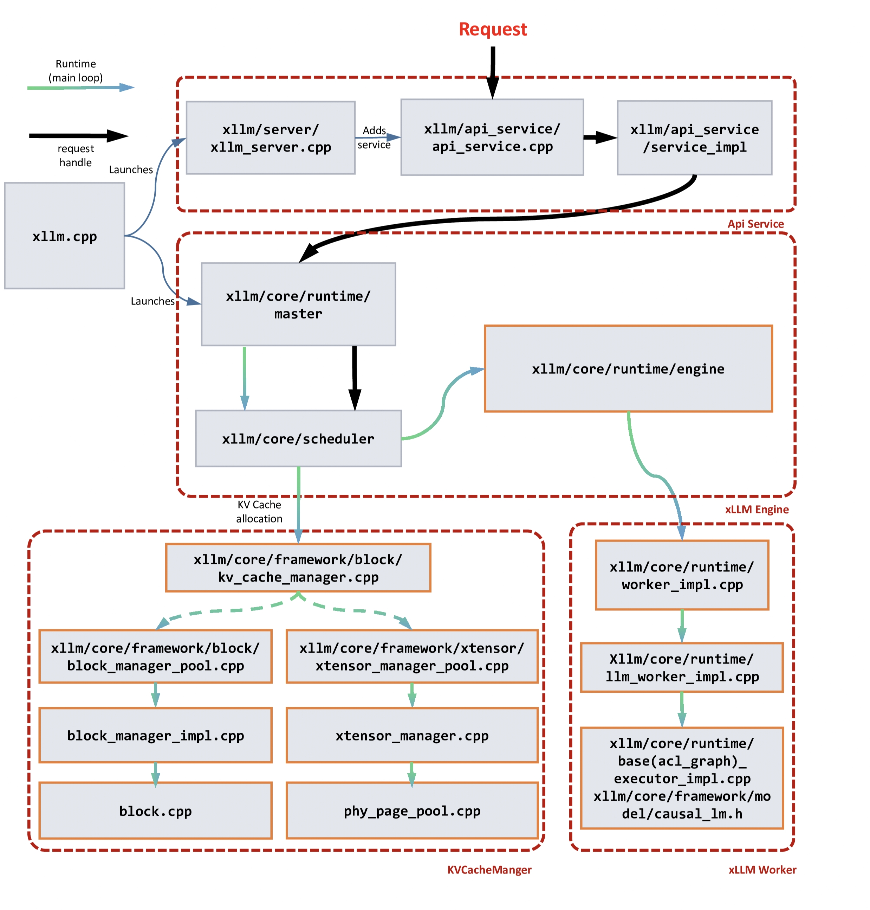

# Technical Briefing on xLLM Core Modules and Architecture

This document provides a technical overview of the core modules within the xLLM inference serving system, detailing their functionality, architectural positioning, and key responsibilities.

## Core Module Functionality Overview

The following table summarizes the primary components of the xLLM architecture, their corresponding code locations, and their roles in the inference pipeline.

| Module Name | Code Path | Core Functionality | Key Responsibilities |
| :--- | :--- | :--- | :--- |
| **APIService** | `api_service/` | External Interface Service | Receives external requests (e.g., OpenAI-compatible API calls), translates them into the internal request format, and forwards them to the Master. |
| **Master** (LLM Master) | `core/runtime/llm_master.cpp` | Control Plane & Request Dispatcher | Receives requests and drives the main execution loop for the Scheduler and Engine. |
| **Scheduler** (Continuous Scheduler) | `core/scheduler/continuous_scheduler.cpp` | Request Scheduling & Batching | Implements dynamic scheduling policies, prepares batch data for processing, and manages the logical allocation of KV Cache. |
| **Engine** (LLM Engine) | `core/runtime/llm_engine.cpp` | Execution Layer Manager | Manages distributed Workers, initializes the model, orchestrates inference execution steps, and handles multi-layer pipeline optimization. |
| **Worker** (LLM Worker / Worker Impl) | `core/runtime/llm_worker_impl.cpp` | Actual Computation Unit | Executes the model's forward pass on the AI accelerator and manages the local physical KV Cache. |
| **KV Cache Manager** | `core/framework/block/` & `core/framework/xtensor/` | Global KV Cache Management | Provides unified management for KV Cache, including optional support for continuous KV Cache allocation. |

## Detailed Module Descriptions

### 1. APIService

The **APIService** module functions as the external interface layer for xLLM, serving as the initial entry point for all client requests. It is responsible for receiving inference requests and exposing an **OpenAI-compatible API** (e.g., `/v1/chat/completions`).

**Code Entry Point**: `api_service/api_service.cpp`

*   **Service Encapsulation**: The service implementation (`chat_service_impl`) is constructed within `api_service/api_service.cpp` and integrated into the **brpc server** framework.
*   **Request Forwarding**: Upon receiving a request, the `ChatCompletionsImpl` invokes the `process_async` method of the `ChatServiceImpl`.
*   **Core Invocation**: In `chat_service_impl.cpp`, the request is ultimately forwarded to the **Master** module via `master_->handle_request` for subsequent scheduling and execution.

  

### 2. Master (LLM Master)

The **Master** module constitutes the **control plane** of the xLLM inference service. It accepts user requests from the APIService and acts as the central coordinator, managing the entire request lifecycle, including queuing, scheduling, and execution.

**Code Entry Point**: `core/runtime/llm_master.cpp`

*   **Component Integration**: The Master initializes core components such as the **Engine** and **Scheduler** within its constructor.
*   **Request Dispatch**: Incoming requests are asynchronously dispatched for execution (`handle_request`) via an internal **thread pool** (`threadpool_`).
*   **Driver Loop**: The Master maintains a primary execution loop (`run`) that continuously invokes the Scheduler's `step` method, driving the overall inference process forward.

  

### 3. Scheduler (Continuous Scheduler)

The **Scheduler** module is responsible for managing all pending requests and applying sophisticated **dynamic scheduling policies** to determine which requests can be coalesced into a single **Batch** for concurrent inference.

**Code Entry Point**: `core/scheduler/continuous_scheduler.cpp`

*   **Request Enqueuing**: Requests received from the API service are written to the internal request queue (`request_queue_.write(request)`).
*   **Scheduling Logic**: The `Step` method executes the `schedule_request` logic, which involves preparing batch data (`prepare_batch`), processing both **Prefill** and **Decode** requests, and interacting with the **KV Cache Manager** for cache allocation and deallocation.
*   **Execution Invocation**: Once scheduling is complete, the prepared batch data is passed to the **Engine's** `step` method for execution.

  

### 4. Engine (LLM Engine)

The **Engine** module serves as the **execution layer manager**, responsible for distributing the batch tasks prepared by the Scheduler to the underlying **Worker** computation units and managing the execution flow in a distributed environment.

**Code Entry Point**: `core/runtime/llm_engine.cpp`

*   **Initialization**: The Engine initializes the distributed manager (`dist_manager`) during construction. Its `Init()` method handles model initialization and the estimation and allocation of the global KV Cache capacity.
*   **Execution Orchestration**: In each inference step (`Step`), the Engine updates global parameters related to **Data Parallelism (DP)** and asynchronously dispatches the batch task to each Worker client via `worker_clients_[worker_rank]->step_async`.

  

### 5. Worker (LLM Worker / Worker Impl)

The **Worker** module is the fundamental unit for executing model computation within xLLM, typically bound to one or more **AI accelerator devices**.

**Code Entry Point**: `core/runtime/llm_worker_impl.cpp`

*   **Local Resource Management**: The Worker is responsible for allocating the local physical memory for the KV Cache (`allocate_kv_cache`) during its initialization phase.
*   **Asynchronous Computation**: It receives asynchronous calls (`step_async`) from the Engine and schedules the actual computation task via an internal thread pool.
*   **Model Forward Pass**: The core `Step` method invokes `model_executor_->forward`, which executes the model's forward computation, taking the input **Tokens**, position information, and **KV Cache** as arguments.

  

### 6. KV Cache Manager (Block Manager & xTensor Manager)

The **KV Cache Manager** is responsible for the unified management of the KV Cache, handling allocation when the Scheduler module dispatches requests.

**Code Entry Points**: `core/framework/block/` and `core/framework/xtensor/`

#### 6.1 Block Manager

The **Block Manager** is responsible for the allocation and sharing of KV Cache Blocks, implementing the **PagedAttention** mechanism.

*   **Block Allocation**: It manages a pool of free blocks and retrieves a Block ID from this pool during the `allocate` method.
*   **Prefix Cache**: It supports the `allocate_shared` method, which enables the reuse of existing KV blocks by matching a Token ID hash (`prefix_cache_->match`), thereby enhancing memory utilization.

#### 6.2 xTensor Manager

The **xTensor Manager**, in conjunction with the **PhyPagePool**, implements the decoupling of logical address and physical memory mapping based on a **Virtual Memory Management (VMM) API**. This design facilitates **continuous KV Cache storage** and **on-demand physical memory allocation**.

*   **xTensor Manager**: In the `allocate` method, it requests physical page IDs from the `PhyPagePool` and attaches these physical pages to multi-layer K/V xTensors, managing the mapping from logical addresses to physical page IDs.
*   **PhyPagePool**: This component manages the pool of physical memory pages on the AI accelerator. It executes low-level operations such as `batch_map` to map physical pages to the virtual pointers of the xTensor, realizing a memory management model characterized by **"logically contiguous, physically discrete"** storage.

  

## Execution Flow Diagram

This diagram visually represents the interaction and data flow between the APIService, Master, Scheduler, Engine, and Worker modules, illustrating the control plane and data plane separation.

  

