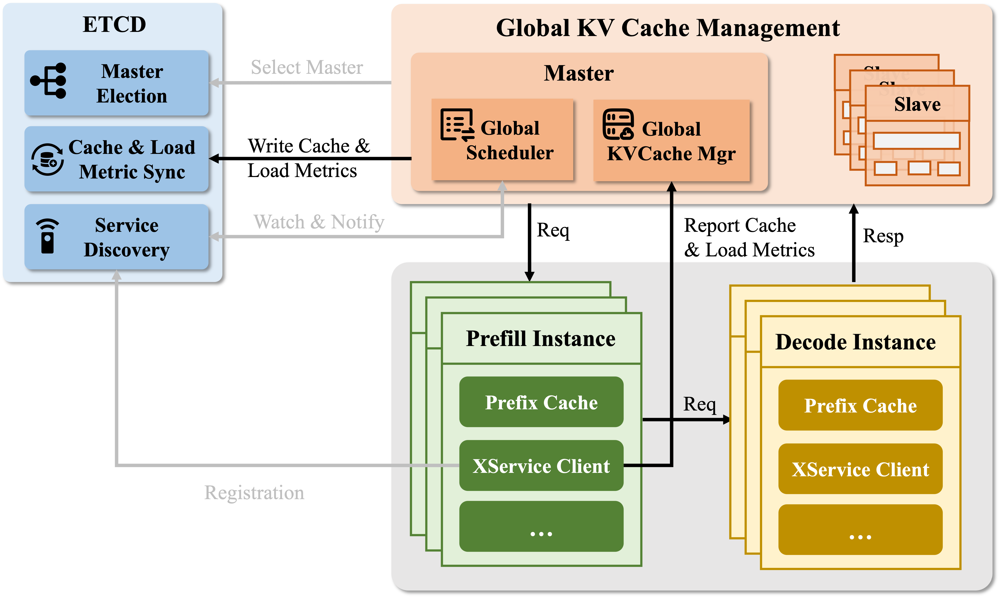
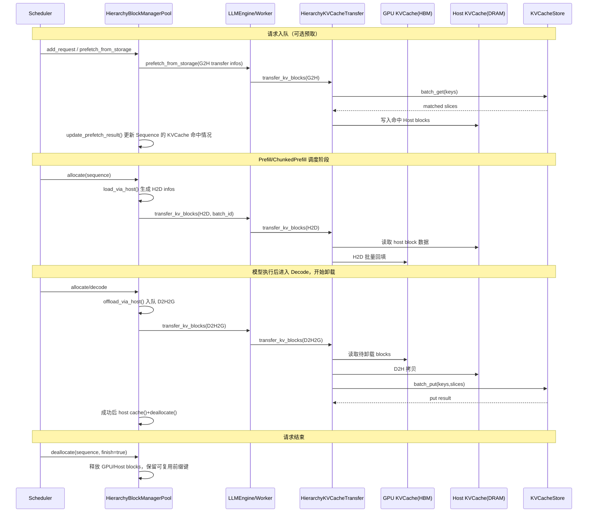
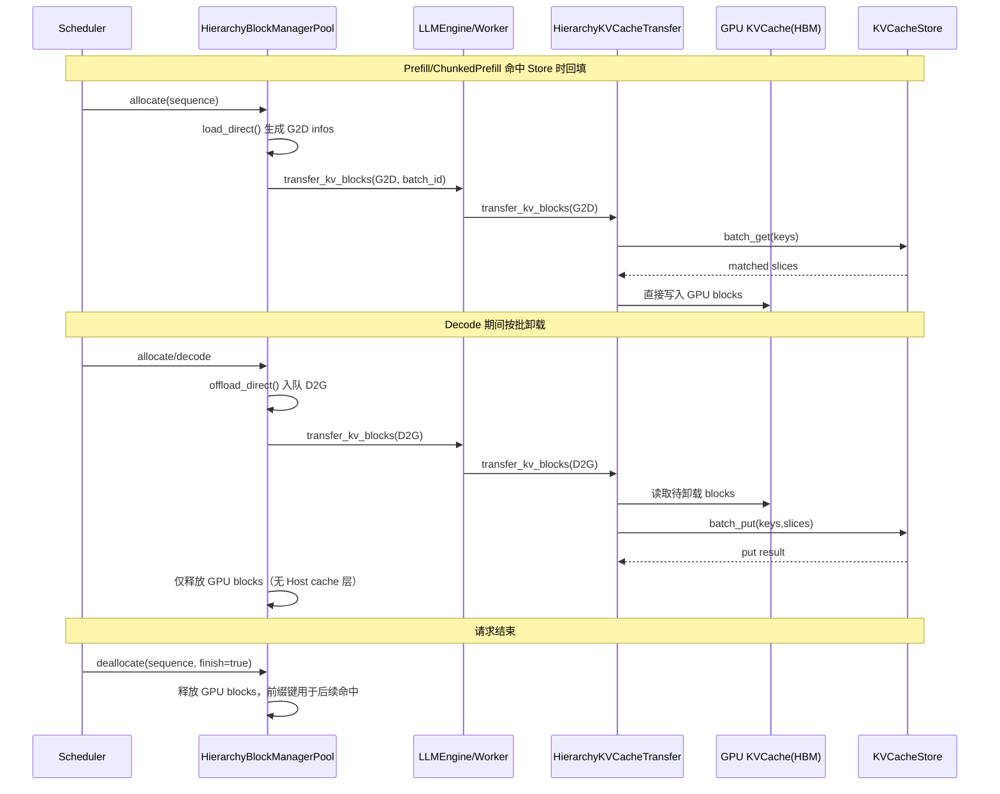

# 全局多级 KV Cache

## 1. 问题和挑战

### 1.1 问题一：多轮对话和多副本部署下，Prefix Cache 命中依赖路由

在多轮对话场景中，上一轮对话的答案通常会拼接进下一轮请求，成为下一轮 prompt 的一部分。这样一来，上一轮对话已经生成过的 KVCache，在下一轮理论上是可以继续复用的。

但在多副本部署场景下，如果 Prefix Cache 只保存在本地推理节点的 HBM 中，就会出现一个额外约束：

- 某段前缀的 KVCache 只存在于“生成它的那个节点”本地。
- 如果下一轮请求被负载均衡到了其他副本，即使它和上一轮共享大量前缀，也无法命中之前的 Prefix Cache。
- 这意味着想要获得较高的前缀命中率，请求不能只按“随机”或“纯负载”方式分发，还需要考虑“哪个节点已经持有可复用的前缀”。

也就是说，多副本场景下，Prefix Cache 不只是一个本地缓存问题，同时还是一个路由问题。

#### PD 分离场景的额外问题

在 PD 分离场景下，问题会进一步放大。

- Decode 节点会持续积累大量历史 KVCache。
- 但这些 KVCache 留在 D 节点本地时，无法直接给后续 Prefill 任务做贡献。
- 仅靠“把请求路由到命中缓存的节点”并不能解决这个问题，因为 Prefill 和 Decode 本来就发生在不同角色的节点上。

### 1.2 问题二：仅依赖 HBM Prefix Cache，缓存会因为容量限制而老化淘汰

即使请求已经被路由到了“正确的节点”，仅使用 HBM 中的 Prefix Cache 仍然不够。

- HBM 是模型执行的核心资源，既要存模型权重，也要存活跃请求的 KVCache。
- 当上下文变长、并发升高，或者长序列请求持续进入时，HBM 中可用于 Prefix Cache 的空间会越来越紧张。
- 老的 KV block 最终会因为容量限制被淘汰或老化掉。
- 这样一来，即使后续相同请求再次到达同一个节点，也可能已经没有对应的 Prefix Cache 可以命中，仍然需要重新 Prefill。

因此，本地 HBM Prefix Cache 只能解决“短时间、单节点”的复用问题，无法稳定支撑跨时间、跨节点的全局 KV 复用。

## 2. 解决方案

针对上述问题，xLLM 在项目中使用了两套互补的方案：

### 2.1 方案一：Cache-Aware 调度

针对“多副本场景下 Prefix Cache 命中依赖路由”的问题，xLLM 引入了 cache-aware 调度链路：

- `xLLM Instance`：按照心跳上报本地 Prefix Cache 的新增/删除信息以及负载情况。
- `xLLM Service`：基于各实例上报的prefix cache 信息和节点负载，执行 cache aware routing。

### 2.2 方案二：全局 KVCache Pool

针对“HBM 本地缓存会老化淘汰”以及“PD 分离场景下 D 节点缓存无法贡献给 Prefill”的问题，xLLM 引入了全局 KVCache Pool。

- 通过 `Mooncake Store` 将 KVCache 从“单节点 HBM 本地资源”扩展为“全局可访问资源”。
- 任意节点产生的 KVCache，都可以被写入全局 Store。
- 任意节点上的后续请求，都可以通过全局唯一的 key 从全局 Store 读取并复用这些 KVCache。

针对 xLLM 支持的多种芯片，xLLM 为 KVCache Pool 设计了两种数据面路径：

- 直连模式：`Device <-> Store`，数据路径更短，当前主要支持 NPU 设备。
- Host 中转模式：`Device <-> Host <-> Store`，通过 Host staging 和 RDMA 传输链路实现，兼容性更强。

## 3. 详细设计

xLLM 的全局 KVCache 由两条链路组成，分别对应上面的两套方案：

### 3.1 Cache-Aware 调度

- `xLLM Service`：实例管理、请求路由、负载感知。
- `PrefixCache + XServiceClient`：上传本地 Prefix 缓存变更（新增/删除 hash key）， 以及负载信息。

### 3.2 KVCache Pool

- `HierarchyBlockManagerPool`：在调度阶段决定 load/offload 策略并生成 `BlockTransferInfo`。
- `HierarchyKVCacheTransfer`：执行 `G2H/H2D/D2H2G/D2G/G2D` 传输。
- `KVCacheStore (Mooncake Client)`：执行 `batch_put/batch_get/batch_exist`。

#### 3.2.1 Host 中转模式

#### 3.2.2 直连模式

## 4. KVCache Pool 相关功能整理

### 4.1 初始化与模式选择

`HierarchyKVCacheTransfer` 在初始化时，会根据 `host_blocks_factor` 选择 `KVCacheStore` 的切片格式；但结合 `HierarchyBlockManagerPool` 的 Host block 创建逻辑后，当前代码真正可稳定使用的只有两档：

- `host_blocks_factor == 0`：`TensorFormat::LAYER_WISE`，Store 与 Device 直连，按 layer 分批复制。
- `host_blocks_factor > 1`：`TensorFormat::BLOCK_WISE`，使用 Host 缓存池作为 Store 读写载体。

实现限制（重要）：

- `HierarchyKVCacheTransfer` 里 `host_blocks_factor < 1.0` 会走 `LAYER_WISE`，`>= 1.0` 会走 `BLOCK_WISE`。
- 但 `HierarchyBlockManagerPool` 是否创建 Host block manager，取决于 `host_num_blocks = floor(hbm_blocks * host_blocks_factor)` 是否大于 `0`。
- 同时，页对齐 Host 缓冲区只在 `host_blocks_factor > 1` 时才创建。
- 因此 `host_blocks_factor == 1`、以及 `0 < host_blocks_factor < 1` 在当前实现里都会落到不一致路径，不应使用。

补充行为：

- `store_protocol=rdma` 时，若环境变量 `DEVICE_NAMES` 未配置，会回退到 `tcp`。
- `enable_mla=true` 时，Store 侧会将 `tp_rank/tp_size` 固定为 `0/1`。

### 4.2 Key 规则与切片组织

Store key 规则统一为：

`hash_key-tp_rank-slice_idx`

- `hash_key`：来自 `PrefixCache::compute_hash_keys(...)` 计算的 `XXH3 128-bit` 分块前缀哈希。
- `tp_rank`：用于张量并行隔离。
- `slice_idx`：用于 layer-wise 分片序号。

其中 `hash_key` 不是“当前 block 内容”的独立哈希，而是“到当前 block 为止的完整前缀哈希”：

- 第一个 block：`XXH3_128(block_tokens)`
- 后续 block：`XXH3_128(prev_hash || current_block_tokens)`

这意味着命中语义是“连续前缀命中”，而不是单个 block 可独立乱序复用。

两种切片格式：

- `TensorFormat::BLOCK_WISE`
  - 每个 block 切片内包含所有 layer 的 K/V(/index)。
  - 对应 Host 中转模式在 DRAM 中主动构造的“聚合 block”视图。
  - 以常见 K/V 场景为例，一个逻辑 block 聚合后可压缩为 `2` 个连续地址，而不是 `layers * 2` 个离散地址。
  - 常用于 Host 中转场景（`D2H2G`、`G2H + H2D`）。
- `TensorFormat::LAYER_WISE`
  - 按 `layers_wise_copy_batchs` 将 layer 分组切片。
  - 对应直连模式下保留 HBM 原始 layer-major 布局后的 Store 视图。
  - 常用于 Store 直连场景（`D2G`、`G2D`）。

### 4.3 `batch_put/get/exist` 的实现语义

| 接口 | 用途 | 关键语义 |
| --- | --- | --- |
| `batch_put` | 批量写入 Store | 写入前会逐 key 执行 `IsExist`，已存在 key 会跳过写入并按“成功”计数，避免重复覆盖。 |
| `batch_get` | 批量拉取 KV | 按 `hash_key-tp_rank-slice_idx` 精确读取，并将数据写入目标 block（Host 或 Device）。 |
| `batch_exist` | 批量命中查询 | 会扩展为 `keys x tp_size x layers_wise_copy_batchs` 查询，遇到第一个 miss 即停止计数；只有某个 block 的所有 TP rank、所有 slice 都存在时，才算这个 block 命中。 |

### 4.4 TransferType 与函数映射

| TransferType | 路径 | 入口函数 |
| --- | --- | --- |
| `G2H` | Store -> Host | `HierarchyKVCacheTransfer::transfer_kv_blocks(slice)` |
| `H2D` | Host -> Device | `HierarchyKVCacheTransfer::load_via_host(...)` |
| `D2H2G` | Device -> Host -> Store | `HierarchyKVCacheTransfer::offload_via_host(...)` |
| `D2G` | Device -> Store | `HierarchyKVCacheTransfer::offload_direct(...)` |
| `G2D` | Store -> Device | `HierarchyKVCacheTransfer::load_direct(...)` |

## 5. 参数配置

常用参数说明：

| 参数 | 作用 |
| --- | --- |
| `--enable_prefix_cache` | 前缀哈希与命中前提（Store 依赖此开关） |
| `--enable_kvcache_store` | 打开 Store 数据面读写链路 |
| `--host_blocks_factor` | 选择 Host 中转或 Store 直连模式 |
| `--store_protocol` | Store 协议，常用 `ub/rdma` |
| `--store_master_server_address` | Store master 地址 |
| `--store_metadata_server` | 元数据服务地址 |
| `--store_local_hostname` | 本地 Store 客户端地址（建议 `IP:PORT`） |
| `--prefetch_timeout` | 预取等待窗口（ms），`0` 表示不等待 |
| `--prefetch_bacth_size` | 预取分批大小 |
| `--layers_wise_copy_batchs` | layer-wise copy 批数；当前实现建议配置为可整除层数的值 |
| `--offload_batch` | Decode 阶段触发卸载的批量阈值 |

实际生效逻辑：
| 参数 | 实际生效条件 |
| --- | --- |
| `enable_service_routing` | `FLAGS_enable_service_routing || FLAGS_enable_disagg_pd` |
| `enable_cache_upload` | `(FLAGS_enable_service_routing || FLAGS_enable_disagg_pd) && FLAGS_enable_prefix_cache && FLAGS_enable_cache_upload` |
| `enable_kvcache_store` | `FLAGS_enable_kvcache_store && FLAGS_enable_prefix_cache` |
| `prefetch_from_storage` | 仅当 `enable_kvcache_store=true` 且存在 Host block 池（Host 中转模式）时触发 |

## 6. 使用示例

- [scripts/run.sh](../../../scripts/run.sh)，添加 `-h` 查看具体参数。

## 7. 代码定位

- `xllm/core/framework/kv_cache/kv_cache_store.{h,cpp}`
- `xllm/core/framework/kv_cache/hierarchy_kv_cache_transfer.{h,cpp}`
- `xllm/core/framework/block/hierarchy_block_manager_pool.{h,cpp}`
- `xllm/core/framework/prefix_cache/prefix_cache_with_upload.{h,cpp}`
- `xllm/core/runtime/xservice_client.cpp`
- `xllm/core/scheduler/continuous_scheduler.cpp`
