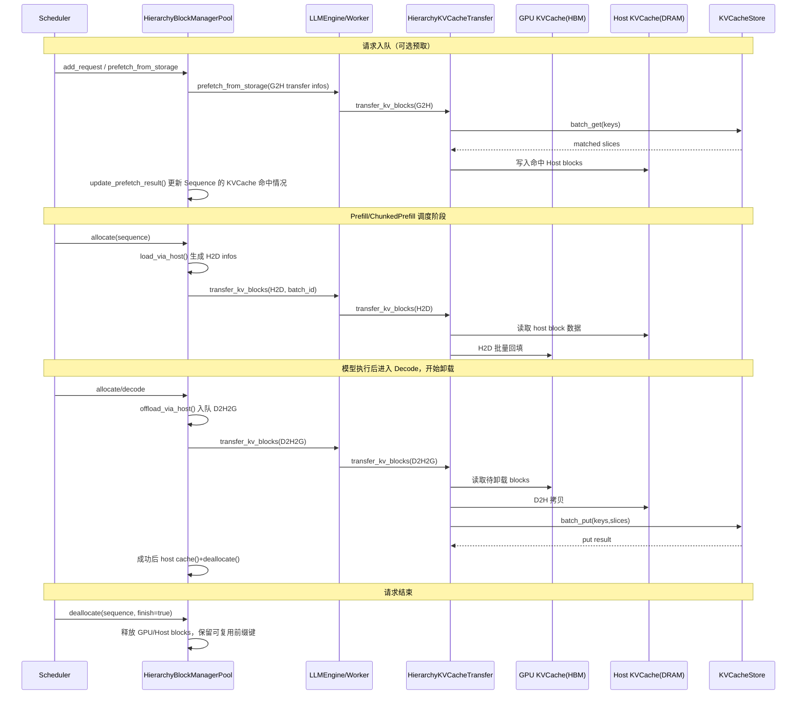
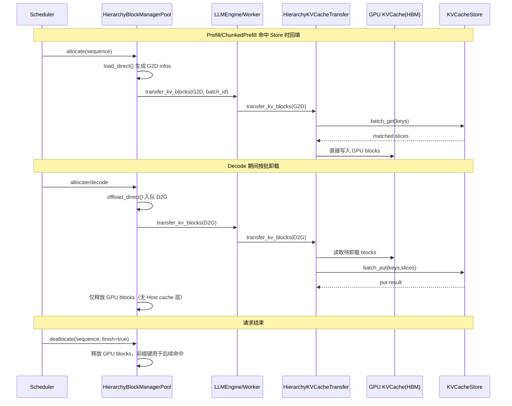

# 全局多级 KV Cache

## 1. 背景

LLM 在长上下文场景下，KVCache 的容量和带宽会快速成为瓶颈。xLLM 的全局多级 KV Cache 目标是把 KV 从“单机单卡资源”扩展到“跨实例可复用资源”，减少重复 Prefill，提升整体吞吐与资源利用率。

## 2. 设计目标

1. 让 KV 在 `Device(HBM)`、`Host(DRAM)`、`Store(全局存储)` 三层之间可控流动。
2. 通过 Prefix 命中复用历史 KV，减少重复 Prefill。
3. 将状态同步（控制面）与数据搬运（数据面）解耦，便于弹性扩展。

## 3. 架构总览

xLLM 的全局 KVCache 由两条链路组成：

1. 控制面链路（状态感知与路由）

- `etcd`：实例注册、发现与元数据同步。
- `xLLM Service`：实例管理、请求路由、负载感知。
- `PrefixCacheWithUpload + XServiceClient`：上传本地 Prefix 缓存变更（新增/删除 hash key）。

2. 数据面链路（KV 真实读写）

- `HierarchyBlockManagerPool`：在调度阶段决定 load/offload 策略并生成 `BlockTransferInfo`。
- `HierarchyKVCacheTransfer`：执行 `G2H/H2D/D2H2G/D2G/G2D` 传输。
- `KVCacheStore (Mooncake Client)`：执行 `batch_put/batch_get/batch_exist`。

说明：`enable_cache_upload` 只上报“缓存状态变化”，不传输 KV 数据本体；KV 数据本体由 `KVCacheStore` 负责。

整体架构图如下：

## 4. KVCache Store 相关功能整理

### 4.1 初始化与模式选择

`HierarchyKVCacheTransfer` 在初始化时，根据 `host_blocks_factor` 选择 `KVCacheStore` 的切片格式：

- `host_blocks_factor > 1`：`TensorFormat::BLOCK_WISE`，使用 Host 缓存池作为 Store 读写载体。
- `host_blocks_factor < 1`：`TensorFormat::LAYER_WISE`，Store 与 Device 直连，按 layer 分批复制。

补充行为：

- `store_protocol=rdma` 时，若环境变量 `DEVICE_NAMES` 未配置，会回退到 `tcp`。
- `enable_mla=true` 时，Store 侧会将 `tp_rank/tp_size` 固定为 `0/1`。

### 4.2 Key 规则与切片组织

Store key 规则统一为：

`hash_key-tp_rank-slice_idx`

- `hash_key`：来自 `PrefixCache::compute_hash_keys(...)` 计算的 `XXH3 128-bit` 分块前缀哈希。
- `tp_rank`：用于张量并行隔离。
- `slice_idx`：用于 layer-wise 分片序号。

两种切片格式：

- `TensorFormat::BLOCK_WISE`
  - 每个 block 切片内包含所有 layer 的 K/V(/index)。
  - 常用于 Host 中转场景（`D2H2G`、`G2H + H2D`）。
- `TensorFormat::LAYER_WISE`
  - 按 `layers_wise_copy_batchs` 将 layer 分组切片。
  - 常用于 Store 直连场景（`D2G`、`G2D`）。

### 4.3 `batch_put/get/exist` 的实现语义

| 接口 | 用途 | 关键语义 |
| --- | --- | --- |
| `batch_put` | 批量写入 Store | 写入前会逐 key 执行 `IsExist`，已存在 key 会跳过写入并按“成功”计数，避免重复覆盖。 |
| `batch_get` | 批量拉取 KV | 按 `hash_key-tp_rank-slice_idx` 精确读取，并将数据写入目标 block（Host 或 Device）。 |
| `batch_exist` | 批量命中查询 | 会扩展为 `keys x tp_size x layers_wise_copy_batchs` 查询，遇到第一个 miss 即停止计数，返回“连续可复用 block 数”。 |

### 4.4 TransferType 与函数映射

| TransferType | 路径 | 入口函数 |
| --- | --- | --- |
| `G2H` | Store -> Host | `HierarchyKVCacheTransfer::transfer_kv_blocks(slice)` |
| `H2D` | Host -> Device | `HierarchyKVCacheTransfer::load_via_host(...)` |
| `D2H2G` | Device -> Host -> Store | `HierarchyKVCacheTransfer::offload_via_host(...)` |
| `D2G` | Device -> Store | `HierarchyKVCacheTransfer::offload_direct(...)` |
| `G2D` | Store -> Device | `HierarchyKVCacheTransfer::load_direct(...)` |

## 5. 关键调用链

### 5.1 请求入队预取（仅 Host 中转模式）

1. Scheduler 入队时调用 `kv_cache_manager_->prefetch_from_storage(request)`。
2. `HierarchyBlockManagerPool::prefetch_from_storage(...)` 组装 `G2H` 的 `BlockTransferInfo`。
3. `LLMEngine::prefetch_from_storage(...)` 下发到各 TP Worker。
4. Worker 侧 `PrefetchFromStorage` 采用流式批处理（批大小由 `prefetch_bacth_size` 控制）。
5. `HierarchyKVCacheTransfer` 调用 `KVCacheStore::batch_get(...)` 将命中 KV 写入 Host block。
6. 调度阶段调用 `update_prefetch_result(timeout)`，依据 `prefetch_timeout` 决定等待或继续推进。

### 5.2 Prefill/Chunked Prefill 回填

1. `HierarchyBlockManagerPool::allocate(...)` 在 Prefill 阶段决定：

- Host 中转：`load_via_host`，生成 `H2D` 任务。
- Store 直连：`load_direct`，生成 `G2D` 任务。

2. `transfer_blocks(...)` 下发到 Worker。
3. Worker 通过 `HierarchyKVCacheTransfer` 执行对应 copy，并通过 layer-wise 同步器与计算阶段衔接。

### 5.3 Decode 卸载

1. Decode 阶段 `allocate(...)` 触发卸载策略：

- Host 中转：`offload_via_host`，任务类型 `D2H2G`。
- Store 直连：`offload_direct`，任务类型 `D2G`。

2. `transfer_blocks()` 异步提交卸载任务。
3. 卸载成功后释放 Device block；Host 中转模式下会额外缓存并释放 Host block。

### 5.4 控制面上报（与 Store 数据面解耦）

1. `PrefixCacheWithUpload` 将 insert/evict 产生的 hash key 变更写入双缓冲事件集。
2. `BlockManagerPool::get_merged_kvcache_event(...)` 聚合事件。
3. `XServiceClient::heartbeat()` 周期性上报 `stored_cache/removed_cache` 到 xLLM Service。

### 5.5  KVcache在三层存储之间流动时序图

#### 5.5.1 Host 中转模式（GPU <-> Host <-> Store）

#### 5.5.2 直连（GPU <-> Store）

## 6. 运行模式映射

| 参数组合 | 运行模式 | 数据主路径 |
| --- | --- | --- |
| `host_blocks_factor > 1` 且 `enable_kvcache_store=true` | Host 中转 | `Device <-> Host <-> Store` |
| `host_blocks_factor = 0` 且 `enable_kvcache_store=true` | Store 直连 | `Device <-> Store` |
| `host_blocks_factor > 1` 且 `enable_kvcache_store=false` | 本地分层（无 Store） | `Device <-> Host` |
| `enable_kvcache_store=false` | 非全局 KVCache 场景 | 不访问 Store |

建议：

- 当前实现建议将 `host_blocks_factor` 配置为 `0` 或 `>1` 两档，避免使用临界值配置。

## 7. 参数生效条件（重要）

以下为代码中的实际生效逻辑：

| 参数 | 实际生效条件 |
| --- | --- |
| `enable_service_routing` | `FLAGS_enable_service_routing \\ FLAGS_enable_disagg_pd` |
| `enable_cache_upload` | `(FLAGS_enable_service_routing \\ FLAGS_enable_disagg_pd) && FLAGS_enable_prefix_cache && FLAGS_enable_cache_upload` |
| `enable_kvcache_store` | `FLAGS_enable_kvcache_store && FLAGS_enable_prefix_cache` |
| `prefetch_from_storage` | 仅当 `enable_kvcache_store=true` 且存在 Host block 池（Host 中转模式）时触发 |

常用参数说明：

| 参数 | 作用 |
| --- | --- |
| `--enable_prefix_cache` | 前缀哈希与命中前提（Store 依赖此开关） |
| `--enable_kvcache_store` | 打开 Store 数据面读写链路 |
| `--host_blocks_factor` | 选择 Host 中转或 Store 直连模式 |
| `--store_protocol` | Store 协议，常用 `tcp/rdma` |
| `--store_master_server_address` | Store master 地址 |
| `--store_metadata_server` | 元数据服务地址 |
| `--store_local_hostname` | 本地 Store 客户端地址（建议 `IP:PORT`） |
| `--prefetch_timeout` | 预取等待窗口（ms），`0` 表示不等待 |
| `--prefetch_bacth_size` | 预取分批大小 |
| `--layers_wise_copy_batchs` | layer-wise copy 批数 |
| `--offload_batch` | Decode 阶段触发卸载的批量阈值 |

## 8. 使用示例

- [scripts/run.sh](../../../scripts/run.sh)，添加 `-h` 查看具体参数。

## 9. 常见问题与排查

1. `enable_kvcache_store=true` 但没有命中复用。

- 检查是否同时开启 `--enable_prefix_cache=true`。
- 检查是否是“整块前缀”命中；未满 block 的尾部不会形成可复用块。

2. Host 中转启动时报 `Failed to lock memory pool`。

- 这是 `mlock` 锁页失败，按日志提示调整 `ulimit -l` 后重启。

3. `rdma` 模式初始化异常或自动回退。

- 检查 `DEVICE_NAMES`；未配置时会降级为 `tcp`。

4. 预取效果不稳定。

- 调整 `prefetch_timeout` 与 `prefetch_bacth_size`。
- 注意 `host_blocks_factor=0` 的直连模式不会走 `G2H` 预取。

## 10. 代码定位

- `xllm/core/framework/kv_cache/kv_cache_store.{h,cpp}`
- `xllm/core/framework/kv_cache/hierarchy_kv_cache_transfer.{h,cpp}`
- `xllm/core/framework/block/hierarchy_block_manager_pool.{h,cpp}`
- `xllm/core/framework/prefix_cache/prefix_cache_with_upload.{h,cpp}`
- `xllm/core/runtime/xservice_client.cpp`
- `xllm/core/scheduler/continuous_scheduler.cpp`

## 11. 相关文档

- [Prefix Cache 机制](./prefix_cache.md)
- [PD分离](./disagg_pd.md)
